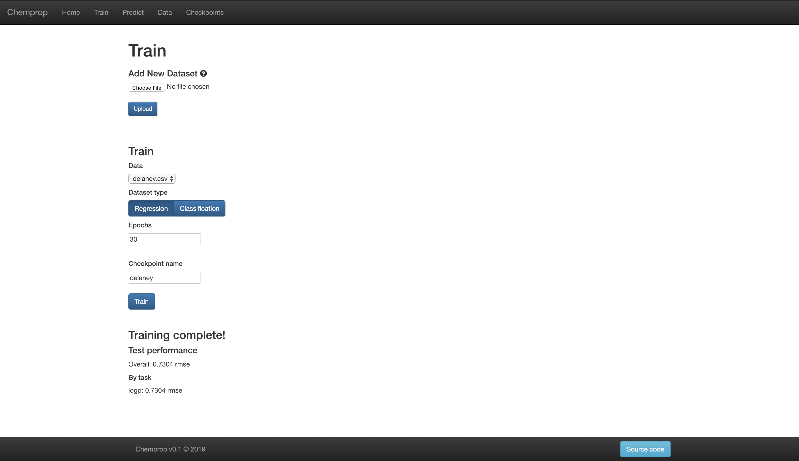
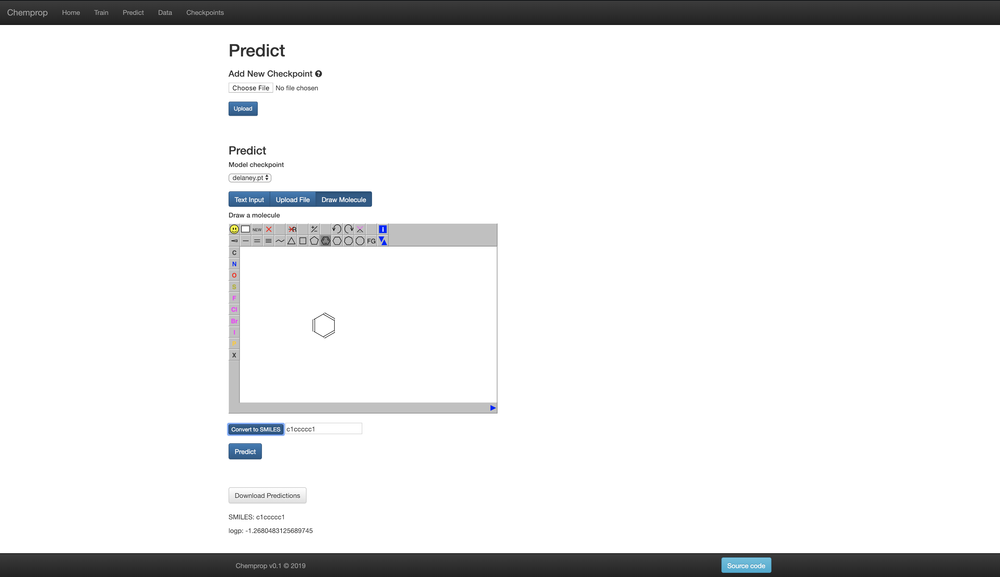

# Property Prediction
This repository contains message passing neural networks for molecular property prediction.

## Table of Contents

- [Requirements](#requirements)
- [Installation](#installation)
  * [Option 1: Conda](#option-1-conda)
  * [Option 2: Docker](#option-2-docker)
  * [(Optional) Installing `chemprop` as a Package](#optional-installing-chemprop-as-a-package)
  * [Notes](#notes)
- [Web Interface](#web-interface)
- [Data](#data)
- [Training](#training)
  * [Train/Validation/Test Splits](#train-validation-test-splits)
  * [Cross validation](#cross-validation)
  * [Ensembling](#ensembling)
  * [Hyperparameter Optimization](#hyperparameter-optimization)
- [Predicting](#predicting)
- [TensorBoard](#tensorboard)
- [Results](#results)

## Requirements

While it is possible to run all of the code on a CPU-only machine, GPUs make training significantly faster. To run with GPUs, you will need:
 * cuda >= 8.0
 * cuDNN

## Installation

### Option 1: Conda

The easiest way to install the `chemprop` dependencies is via conda. Here are the steps:

1. Install Miniconda from [https://conda.io/miniconda.html](https://conda.io/miniconda.html)
2. `cd /path/to/chemprop`
3. `conda env create -f environment.yml`
4. `source activate chemprop` (or `conda activate chemprop` for newer versions of conda)
5. `pip install -r requirements.txt`

### Option 2: Docker

Docker provides a nice way to isolate the `chemprop` code and environment. To install and run our code in a Docker container, follow these steps:

1. Install Docker from [https://docs.docker.com/install/](https://docs.docker.com/install/)
2. `cd /path/to/chemprop`
3. `docker build -t chemprop .`
4. `docker run -i -t chemprop:latest /bin/bash`

### (Optional) Installing `chemprop` as a Package

If you would like to use functions or classes from `chemprop` in your own code, you can install `chemprop` as a pip package as follows:

1. `cd /path/to/chemprop`
2. `pip install .`

Then you can use `import chemprop` or `from chemprop import ...` in your other code.

### Notes

If you get warning messages about `kyotocabinet` not being installed, it's safe to ignore them.
   
## Web Interface

For those less familiar with the command line, we also have a web interface which allows for basic training and predicting. After installing the dependencies following the instructions above, you can start the web interface by running `python web.py` and then navigating to [localhost:5000](http://localhost:5000) in a web browser.






## Data

In order to train a model, you must provide training data containing molecules (as SMILES strings) and known target values. Targets can either be real numbers, if performing regression, or binary (i.e. 0s and 1s), if performing classification. Target values which are unknown can be left as blanks.

Our model can either train on a single target ("single tasking") or on multiple targets simultaneously ("multi-tasking").

The data file must be be a **CSV file with a header row**. For example:
```
smiles,NR-AR,NR-AR-LBD,NR-AhR,NR-Aromatase,NR-ER,NR-ER-LBD,NR-PPAR-gamma,SR-ARE,SR-ATAD5,SR-HSE,SR-MMP,SR-p53
CCOc1ccc2nc(S(N)(=O)=O)sc2c1,0,0,1,,,0,0,1,0,0,0,0
CCN1C(=O)NC(c2ccccc2)C1=O,0,0,0,0,0,0,0,,0,,0,0
...
```
Datasets from [MoleculeNet](http://moleculenet.ai/) and a 450K subset of ChEMBL from [http://www.bioinf.jku.at/research/lsc/index.html](http://www.bioinf.jku.at/research/lsc/index.html) have been preprocessed and are available in `data.tar.gz`. To uncompress them, run `tar xvzf data.tar.gz`.

## Training

To train a model, run:
```
python train.py --data_path <path> --dataset_type <type> --save_dir <dir>
```
where `<path>` is the path to a CSV file containing a dataset, `<type>` is either "classification" or "regression" depending on the type of the dataset, and `<dir>` is the directory where model checkpoints will be saved.

For example:
```
python train.py --data_path data/tox21.csv --dataset_type classification --save_dir tox21_checkpoints
```

Notes:
* The default metric for classification is AUC and the default metric for regression is RMSE. Other metrics may be specified with `--metric <metric>`.
* `--save_dir` may be left out if you don't want to save model checkpoints.
* `--quiet` can be added to reduce the amount of debugging information printed to the console. Both a quiet and verbose version of the logs are saved in the `save_dir`.

### Train/Validation/Test Splits

Our code supports several methods of splitting data into train, validation, and test sets.

**Random:** By default, the data will be split randomly into train, validation, and test sets.

**Scaffold:** Alternatively, the data can be split by molecular scaffold so that the same scaffold never appears in more than one split. This can be specified by adding `--split_type scaffold_balanced`.

**Separate val/test:** If you have separate data files you would like to use as the validation or test set, you can specify them with `--separate_val_path <val_path>` and/or `--separate_test_path <test_path>`.

Note: By default, both random and scaffold split the data into 80% train, 10% validation, and 10% test. This can be changed with `--split_sizes <train_frac> <val_frac> <test_frac>`. For example, the default setting is `--split_sizes 0.8 0.1 0.1`. Both also involve a random component and can be seeded with `--seed <seed>`. The default setting is `--seed 0`.

### Cross validation

k-fold cross-validation can be run by specifying `--num_folds <k>`. The default is `--num_folds 1`.

### Ensembling

To train an ensemble, specify the number of models in the ensemble with `--ensemble_size <n>`. The default is `--ensemble_size 1`.

### Hyperparameter Optimization

Although the default message passing architecture works quite well on a variety of datasets, optimizing the hyperparameters for a particular dataset often leads to marked improvement in predictive performance. We have automated hyperparameter optimization via Bayesian optimization (using the [hyperopt](https://github.com/hyperopt/hyperopt) package) in `hyperparameter_optimization.py`. This script finds the optimal hidden size, depth, dropout, and number of feed-forward layers for our model. Optimization can be run as follows:
```
python hyperparameter_optimization.py --data_path <data_path> --dataset_type <type> --num_iters <n> --config_save_path <config_path>
```
where `<n>` is the number of hyperparameter settings to try and `<config_path>` is the path to a `.json` file where the optimal hyperparameters will be saved. Once hyperparameter optimization is complete, the optimal hyperparameters can be applied during training by specifying the config path as follows:
```
python train.py --data_path <data_path> --dataset_type <type> --config_path <config_path>
```
 
## Predicting

To load a trained model and make predictions, run `predict.py` and specify:
* `--test_path <path>` Path to the data to predict on.
* A checkpoint by using either:
  * `--checkpoint_dir <dir>` Directory where the model checkpoint(s) are saved (i.e. `--save_dir` during training). This will walk the directory, load all `.pt` files it finds, and treat the models as an ensemble.
  * `--checkpoint_path <path>` Path to a model checkpoint file (`.pt` file).
* `--preds_path` Path where a CSV file containing the predictions will be saved.

For example:
```
python predict.py --test_path data/tox21.csv --checkpoint_dir tox21_checkpoints --preds_path tox21_preds.csv
```
or
```
python predict.py --test_path data/tox21.csv --checkpoint_path tox21_checkpoints/fold_0/model_0/model.pt --preds_path tox21_preds.csv
```

## TensorBoard

During training, TensorBoard logs are automatically saved to the same directory as the model checkpoints. To view TensorBoard logs, run `tensorboard --logdir=<dir>` where `<dir>` is the path to the checkpoint directory. Then navigate to [http://localhost:6006](http://localhost:6006).

## Results

**NOTE:** These results are out of date and will be updated shortly.

We compared our model against the graph convolution in deepchem. Our results are averaged over 3 runs with different random seeds, namely different splits across datasets. Unless otherwise indicated, all models were trained using hidden size 1800, depth 6, and master node. We did a few hyperparameter experiments on qm9, but did no searching on the other datasets, so there may still be further room for improvement.

Results on classification datasets (AUC score, the higher the better)

| Dataset | Size |	Ours |	GraphConv (deepchem) |
| :---: | :---: | :---: | :---: |
| Bace | 1,513 | 0.884 ± 0.034	| 0.783 ± 0.014 |
| BBBP | 2,039 | 0.922 ± 0.012	| 0.690 ± 0.009 |
| Tox21 | 7,831 | 0.851 ± 0.015	| 0.829 ± 0.006 |
| Toxcast | 8,576 | 0.748 ± 0.014	| 0.716 ± 0.014 |
| Sider | 1,427 |	0.643 ± 0.027	| 0.638 ± 0.012 |
| clintox | 1,478 | 0.882 ± 0.022	| 0.807 ± 0.047 |
| MUV | 93,087 | 0.067 ± 0.03* | 0.046 ± 0.031 |
| HIV | 41,127 |	0.821 ± 0.034† |	0.763 ± 0.016 |
| PCBA | 437,928 | 0.218 ± 0.001* | 	0.136 ± 0.003 | 

Results on regression datasets (score, the lower the better)

Dataset | Size | Ours | GraphConv/MPNN (deepchem) |
| :---: | :---: | :---: | :---: |
delaney	| 1,128 | 0.687 ± 0.037 | 	0.58 ± 0.03 |
Freesolv | 642 |	0.915 ± 0.154	| 1.15 ± 0.12 |
Lipo | 4,200 |	0.565 ± 0.052 |	0.655 ± 0.036 |
qm8 | 21,786 |	0.008 ± 0.000 | 0.0143 ± 0.0011 |
qm9 | 133,884 |	2.47 ± 0.036	| 3.2 ± 1.5 |

†HIV was trained with hidden size 1800 and depth 6 but without the master node.
*MUV and PCBA are using a much older version of the model.

Lastly, you can find the code to our original repo at https://github.com/wengong-jin/chemprop and for the Mayr et al. baseline at https://github.com/yangkevin2/lsc_experiments . 
